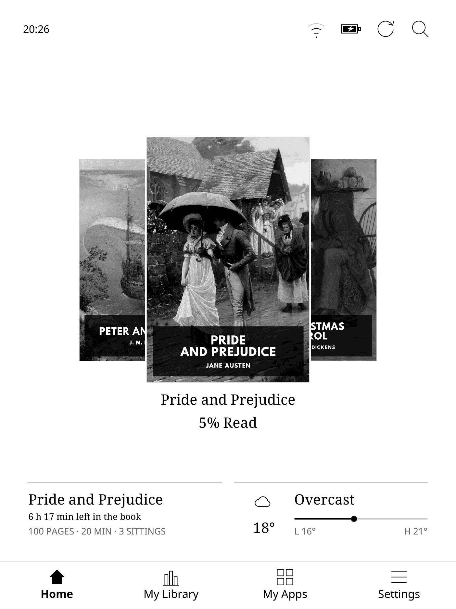

# InkHub

### More possibilities. The same paper-like screen.

An open, Linux-based experience for reading, useful tools and quiet play on your e-reader.

[Explore InkHub](https://einkhub.com) · [See the screens](https://einkhub.com/showcase) · [Release downloads](https://github.com/juicecultus/inkhub-releases/releases) · [Join r/InkHub](https://www.reddit.com/r/InkHub/)

1.0.0_RC is in preparation. Downloads and guided installation open after release testing.

## FROM BOOT TO YOUR NEXT BOOK

<table>
  <tr>
    <th>InkHub boot splash</th>
    <th>Home · Kobo Libra 2</th>
    <th>Home · reMarkable</th>
  </tr>
  <tr>
    <td valign="top"></td>
    <td valign="top"></td>
    <td valign="top"></td>
  </tr>
</table>

InkHub boot artwork and Home screens from development builds.
[Explore Reader, tools, games and Terminal →](https://einkhub.com/showcase)

## YOUR E-READER, WITH MORE FREEDOM

InkHub brings a custom Linux environment to hardware you already own: choose your
reader, bring books from different sources, transfer files without a store account,
and use everyday tools on a quiet e-ink screen. On Kobo Libra 2 it replaces the OS;
on reMarkable it lives alongside the original system, so the native notebook and
drawing experience remains a restart away.

On Kobo Libra 2, Listen plays local audio through Bluetooth headphones or speakers
with Wi-Fi switched off. InkHub controls the radios independently; the
[stock system enables Wi-Fi with Bluetooth](https://help.kobo.com/hc/en-us/articles/4406284800023-Troubleshoot-Bluetooth-pairing-on-your-Kobo-eReader).

## WHAT YOU GET

- A home for your books. A cover carousel, library, search and reading information.
- Reader, made for e-ink. EPUB reading with typography controls, contents, highlights,
  annotations and export, dictionary lookup, Wikipedia and in-book search.
- KOReader alongside Reader. Another reading option for PDFs and other supported formats.
- Tools without the noise. Notes, calculator, Pomodoro, LocalSend file transfers and Terminal.
- A little downtime. Chess, Sudoku, Blocks, Solitaire and other games.
- Device-aware controls. Frontlight, natural light and Bluetooth audio through Listen on
  Kobo Libra 2; orientation and physical-button support where the hardware provides them.

Features follow each device's hardware. A web browser is planned for a future release.

## BRING YOUR LIBRARY. CHOOSE HOW IT GETS HERE.

| What you want to do | InkHub's route |
| --- | --- |
| Find your next book | Browse/search book catalogues from Get books in My Library. Built-in entries include Standard Ebooks, Project Gutenberg, textos.info and Gallica. |
| Use your own catalogue | Add a compatible OPDS catalogue, including a Calibre Content Server. Search and download supported books directly on the device. |
| Manage books from Calibre | Calibre wireless connects to the desktop app over the local network for book transfers and library information, with read-status integration. |
| Send a file from a phone or computer | LocalSend transfers files between compatible devices on the same local network, without uploading them to a cloud service. |
| Drag and drop from a browser | Enable Connect over Wi-Fi, open the address shown on the device, and manage books from a computer's browser. |
| Use a network drive | Connect a compatible file manager through WebDAV to the enabled device share. |
| Use a cable | Kobo offers USB card access; reMarkable uses its USB-network file-sharing route through its local file-sharing service. |
| Keep a cloud book folder available | Cloud folder, powered by rclone, downloads from a configured provider such as Dropbox, Google Drive, OneDrive or Nextcloud/WebDAV. Account setup/import is required; automatic sync is optional. |
| Take your notes with you | Export Reader highlights and annotations, transfer the exported files, or explicitly upload exported notes through Cloud folder. |
| Continue reading elsewhere | Configure reading-progress sync with a compatible KOReader sync service and matching book files. |

Online catalogues need internet access; local transfers need only the relevant local
connection. Catalogue availability, authentication and download rights are controlled
by each provider. Standard Ebooks uses its public search feed; some provider feeds
require membership. Bring your own DRM-free books.

Cloud-folder sync mirrors the selected remote folder: removing a remote book can remove
its downloaded copy on the next sync. Reading-progress compatibility depends on the book and clients.

## CHOOSE YOUR DEVICE

| Device | How InkHub runs | Returning to the original experience |
| --- | --- | --- |
| Kobo Libra 2 | Replaces the installed OS; the guided route uses desktop Chrome. | Return to Kobo in Settings starts the stock-restoration process. Keep the installation backup safe. |
| reMarkable 1 | Dual boot alongside the stock system; the guided route uses a local helper. | Restart into reMarkable for its native notebook and drawing experience. |
| reMarkable 2 | Dual boot alongside the stock system; the guided route uses a local helper. | Restart into reMarkable for its native notebook and drawing experience. |
| reMarkable Paper Pure | Dual boot alongside the stock system; the guided route uses a local helper. | Restart into reMarkable for its native notebook and drawing experience. |

Check the release notes for your exact model and stock-firmware requirements.

## INSTALLATION & UPDATES

The guided service lives at [einkhub.com](https://einkhub.com). When the release opens,
start there for the model-specific preparation, trial and installation steps.

Back up important data first. For Kobo, keep a copy of the card's stock backup on your
computer too: a backup on the same card cannot protect against that card failing.
Do not disconnect power or USB while an installation is writing to the device.

The one-off hosted installation purchase includes future seamless OTA software
installations for that device. Public software releases remain freely available
under their component licences.

## DOWNLOADS YOU CAN VERIFY

Each published release will identify its device, version, installation requirements,
known limitations and verification instructions. It will include the applicable
installation/OTA artifacts, signed manifests, checksums and matching source materials.

Downloads are hosted on GitHub Releases, with a Cloudflare R2 mirror for the browser installer.

Use the files linked in your release's instructions. Signed manifests authenticate
the release; checksums verify the downloaded bytes.

## OPEN SOFTWARE, COMPLETE SOURCES

For device source, choose the explicitly labelled corresponding-source archive attached
to each release. It includes covered sources, patches, build instructions and notices.
GitHub's automatic source ZIP contains this repository's documentation and images.

Component licences provide the applicable rights to build, modify and redistribute
the software. The independent hosted installation and customer-service infrastructure
is proprietary to AllMumsTalk Limited.

## COMMUNITY

Share questions, ideas and bug reports at [r/InkHub](https://www.reddit.com/r/InkHub/).
Community help is available through the subreddit and Reddit DMs.

For a useful bug report, include your device model, InkHub version, the steps to
reproduce it and a screenshot where possible. Remove passwords, serial numbers,
personal documents and other private information before posting logs or pictures.

---

© 2026 AllMumsTalk Limited t/a InkHub

InkHub name, logo and original brand artwork belong to AllMumsTalk Limited.
Book artwork and third-party names remain subject to their respective rights.
InkHub is an independent project.
